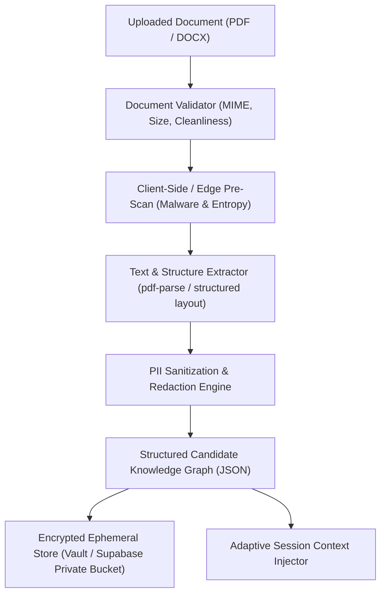

# Architectural Specification: CV Extraction & Candidate Context Grounding

**Document ID:** SPEC-2026-CV-01  
**Status:** Draft / Ready for Review  
**Target Systems:** Universal Interview Engine, Schools Adaptive Engine (`AdaptivePractice`), Employer Screening Engine  

---

## 1. Executive Summary & Objective

The Muqabala Universal Interview Engine adapts its probing based on candidate answers and evidence-source selections (academic projects, internships, personal leadership, customer interactions). Currently, context is provided solely through in-session prompts and candidate inputs.

This specification defines the architecture for ingesting candidate CVs/resumes to:
1. **Ground adaptive probing** in real candidate experiences (e.g., referencing actual university projects or past responsibilities).
2. **Prevent hallucination** by verifying LLM probe claims against an authenticated context graph.
3. **Protect candidate privacy** via client-side/in-flight PII redaction and strict retention lifecycles.
4. **Gracefully support early-career candidates** whose CVs contain limited formal workplace experience.

---

## 2. Ingestion & Document Processing Pipeline



### 2.1 File Ingestion Constraints
- **Accepted Formats:** PDF (native text preferred), DOCX. Scanned PDFs passed through lightweight OCR only when native text stream is unavailable.
- **Maximum File Size:** 5 MB.
- **Max Pages:** 4 pages. Documents exceeding 4 pages are truncated to the first 4 pages with an alert to the candidate.

### 2.2 PII Sanitization & Redaction Rules
To adhere to UAE Federal Decree-Law No. 45 of 2021 on Personal Data Protection (UAE PDP) and GDPR:
1. **Redacted by Default (Never stored or fed to LLM prompts):**
   - National Identification Numbers (Emirates ID, Passport numbers, Social Security).
   - Exact Date of Birth / Age (Year of graduation retained).
   - Marital status, religion, visa status, nationality/ethnicity.
   - Exact residential address (City and Country retained, e.g., "Dubai, UAE").
   - Photograph / facial image data (stripped from raw document).
2. **Preserved for Grounding:**
   - Candidate full name (preferred name).
   - Education history (institution, degree, major, graduation year, key modules/coursework).
   - Work & internship history (company name, role title, duration, bulleted responsibilities).
   - Extracurricular, voluntary, and academic project titles & descriptions.
   - Declared technical and interpersonal competencies.

---

## 3. Structured Candidate Context Schema

The extracted document is transformed into a validated JSON schema before entering the interview context:

```typescript
export interface CandidateCVContext {
  id: string;
  candidateId: string;
  extractedAt: string;
  summary: {
    totalExperienceMonths: number;
    highestEducationLevel: 'high_school' | 'undergraduate' | 'postgraduate' | 'bootcamp';
    primaryDiscipline: string;
  };
  education: Array<{
    institution: string;
    degree: string;
    fieldOfStudy: string;
    startYear?: number;
    endYear?: number;
    highlights: string[];
  }>;
  experience: Array<{
    organization: string;
    role: string;
    isCurrent: boolean;
    startYear: number;
    endYear?: number;
    keyAchievements: string[];
    evidenceDomain: 'work' | 'internship' | 'leadership' | 'academic';
  }>;
  projects: Array<{
    title: string;
    organizationOrCourse?: string;
    description: string;
    technologiesOrSkills: string[];
  }>;
  skills: string[];
  groundingKeywords: string[];
}
```

---

## 4. Integration with the Universal Interview Engine

### 4.1 Grounded Probing Injection
The session coordinator extracts relevant experience nodes based on the current interview competency. For example, during a **Customer Conflict** question, the coordinator queries the CV context for customer-facing or teamwork roles:

```text
[SYSTEM INJECTION - GROUNDING CONTEXT]
Candidate CV indicates experience as "Front Desk Intern" at "Grand Hotel Dubai" (2025) and "Student Council Treasurer" at "American University of Sharjah" (2024).
When formulating an adaptive follow-up probe:
- You may reference these specific domains if the candidate's answer is vague.
- Example: "In your role at Grand Hotel Dubai, did you encounter a similar guest expectation issue?"
- DO NOT invent roles, responsibilities, or dates not present in this context.
```

### 4.2 Anti-Hallucination Grounding Checker
Before delivering an adaptive question to the candidate:
1. **Fact-Claim Extraction:** The system parses the candidate's answer and the proposed interviewer probe for specific entity claims (companies, tools, titles).
2. **Cross-Check:** Any entity introduced by the *interviewer* must either exist in:
   - The candidate's spoken/written answers during this session, OR
   - The verified `CandidateCVContext`.
3. **Rejection Policy:** If the interviewer probe invents a company or title not in the grounding context, the probe is discarded and the engine falls back to standard competency probing.

---

## 5. Early-Career & Sparse-CV Support

A primary user demographic in the Schools portal is early-career university students with sparse work histories.

### 5.1 Context Deficit Handling
When `experience.length === 0` or total workplace experience is under 3 months:
1. The engine flags `earlyCareerProfile: true`.
2. Probing prompts automatically bias toward:
   - Capstone / group university projects.
   - Club, sports, and student society leadership.
   - Academic coursework challenges and deadlines.
   - Part-time campus or voluntary roles.
3. Fallback options in the interview UI (`I don't have direct work experience for this`) remain enabled and context-aware, offering pre-seeded academic prompts derived from the student's degree.

---

## 6. Retention, Security & Deletion Lifecycle

1. **Storage Tier:**
   - Raw uploaded files are stored in an encrypted private Supabase Storage bucket (`candidate-documents-vault`) with strict Row Level Security (RLS).
   - Only the candidate and authorized institutional administrators can access the raw document.
2. **Ephemeral Context Cache:**
   - The structured `CandidateCVContext` is cached in encrypted session state for the duration of the practice assignment.
3. **Data Deletion Rights:**
   - Candidates can delete their uploaded CV at any time from `/account` or `/schools/me`.
   - Deletion immediately executes a hard-delete of the file object from storage and the parsed context row from the database.
   - Interview reports generated prior to deletion retain generalized evidence references (e.g. "Candidate referenced front desk experience") without storing the underlying CV document.
