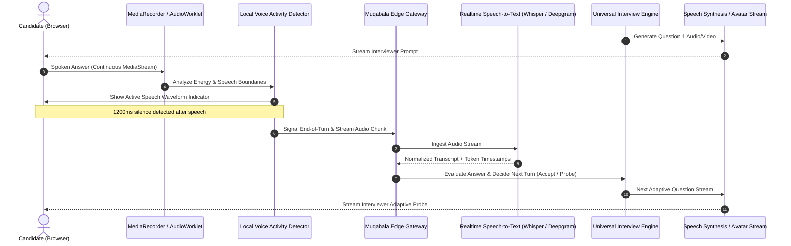

# Architectural Specification: Video Adaptive Interviewing

**Document ID:** SPEC-2026-VIDEO-01  
**Status:** Draft / Ready for Review  
**Target Systems:** Universal Interview Engine, Schools Adaptive Suite, Employer Screening Suite  

---

## 1. Executive Summary & Objective

Muqabala's current interview flow supports text-based adaptive practice with audio dictation assistance. The next evolution introduces an immersive **Video Adaptive Interviewing** experience where candidates interact with a conversational interviewer avatar via video and voice, with questions adapting dynamically turn-by-turn.

This specification establishes the technical architecture, media streaming pipeline, latency targets, evidence-timestamp synchronization, and data privacy safeguards for real-time video adaptive interviewing.

---

## 2. End-to-End Turn-by-Turn Architecture



---

## 3. Media Ingestion & Client Streaming Pipeline

### 3.1 Browser Capture Specifications
- **API:** `navigator.mediaDevices.getUserMedia({ video: true, audio: true })`.
- **Video Constraints:**
  - Resolution: 720p (1280x720) preferred, 480p (854x480) fallback for constrained mobile connections.
  - Frame Rate: 24-30 fps.
  - Codec: VP8 / VP9 or H.264 in `video/webm;codecs=vp8,opus`. Safari fallback: `video/mp4;codecs=avc1,mp4a`.
- **Audio Constraints:**
  - Sample Rate: 48 kHz (downsampled to 16 kHz for STT ingestion).
  - Channels: 1 (Mono).
  - Noise Suppression & Echo Cancellation: Enabled natively (`echoCancellation: true, noiseSuppression: true`).

### 3.2 Chunking vs Whole-Turn Upload
- To ensure zero data loss during network hiccups, candidate video is captured continuously in 5-second chunk increments using `MediaRecorder.ondataavailable`.
- Chunks are tagged with monotonically increasing sequence IDs (`part_001.webm`, `part_002.webm`) and buffered in browser `IndexedDB`.
- Audio slices corresponding to distinct conversational turns are extracted via `AudioContext` and dispatched immediately upon VAD completion for low-latency transcription.

---

## 4. Latency Budgets & Performance Targets

To maintain natural conversational flow without awkward dead time, the turn-around cycle must satisfy the following latency budget:

| Phase | Milestone | Latency Target (p90) | Latency Ceiling (p99) | Mitigation if Exceeded |
|---|---|---|---|---|
| 1 | VAD End-of-Speech Detection | 1,000 ms | 1,400 ms | Candidate can tap "Finish Answer" manually |
| 2 | Edge Transport + STT Transcription | 800 ms | 1,200 ms | Streaming interim transcription during speech |
| 3 | Universal Engine Decision (Adaptive Brain) | 900 ms | 1,400 ms | Lightweight first-pass router; parallel rubric evaluation |
| 4 | Avatar TTS Audio First-Chunk Delivery | 300 ms | 600 ms | Audio streaming with chunked transfer encoding |
| **Total** | **Candidate Stops Speaking → Interlocutor Speaks** | **< 3,000 ms** | **< 4,500 ms** | **Subtle visual cues (e.g. interviewer nodding/considering)** |

### 4.1 Visual Feedback During Thinking Time
If the pipeline exceeds 1,500 ms, the UI transitions the interviewer avatar to an active listening/thinking state ("Reviewing your answer...") to avoid candidate confusion.

---

## 5. Synchronized Evidence Ledger & Timestamp Mapping

A key differentiator of Muqabala is evidentiary feedback: educators and recruiters see exact snippets justifying scores. In video mode, evidence citations must link directly to video player timestamps.

```typescript
export interface VideoEvidenceMarker {
  turnIndex: number;
  questionText: string;
  candidateAnswerExcerpt: string;
  scoreImpact: 'strength' | 'gap' | 'neutral';
  startTimecodeMs: number;
  endTimecodeMs: number;
  evidenceCategory: 'action' | 'outcome' | 'context' | 'metrics';
}
```

### 5.1 Playback Player Integration
In the Educator and Candidate Feedback View:
- Clicking any highlighted excerpt in the feedback card jumps the embedded video player directly to `startTimecodeMs` and plays through `endTimecodeMs`.
- Closed captions (VTT format) are auto-generated and synchronized with the transcript.

---

## 6. Storage, Transcoding & Network Resiliency

1. **Storage Tiering:**
   - Raw video chunks are uploaded directly from the browser to pre-signed S3/Supabase Private Storage URLs via multipart upload.
   - A serverless worker stitches turn chunks into a single master video (`final_interview.mp4`) and an optimized web-streaming HLS stream (`.m3u8` + TS segments).
2. **Offline Buffer & Reconnect:**
   - If the candidate's connection drops mid-interview, recording continues locally in `IndexedDB`.
   - The UI presents a clear banner: "Connection paused. Your answer is safe. Reconnecting...".
   - Chunks resume uploading once network connectivity is restored.

---

## 7. Privacy, Consent & Institutional Governance

1. **Consent & Camera Preview Check:**
   - Prior to entering the video room, candidates must complete a pre-flight hardware check (camera mirror, microphone volume level test, background lighting advice).
   - Clear disclosure statement: "Your video will be reviewed only by your university careers adviser and will not be shared publicly."
2. **Access Control (Row-Level Security):**
   - Video streaming URLs are short-lived signed URLs (15-minute TTL).
   - Only the authentic candidate and authorized cohort advisers can generate read tokens.
3. **Candidate Deletion Right:**
   - When a candidate triggers "Delete all my practice data" under Account Settings, all associated raw video chunks and stitched media are purged within 24 hours.
   - An immutable cryptographic audit receipt is logged in `data_deletion_receipts`.
